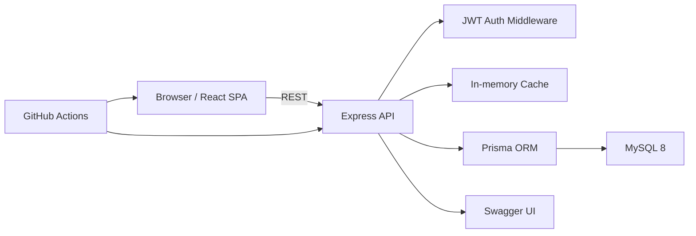

# アーキテクチャ図

```mermaid
flowchart LR
  Browser["Browser / React SPA"] -->|REST| API["Express API"]
  API --> Auth["JWT Auth Middleware"]
  API --> Cache["In-memory Cache"]
  API --> Prisma["Prisma ORM"]
  Prisma --> MySQL["MySQL 8"]
  API --> Docs["Swagger UI"]
  CI["GitHub Actions"] --> API
  CI --> Browser
```

## メモ

- ユーザー画面と管理画面は単一の React アプリ内でルーティング分離しています。
- 注文作成時は Prisma transaction で `Order / OrderItem / Inventory / CartItem` を一括更新します。
- 人気順は `popularity` フィールドを使った簡易アルゴリズムです。
