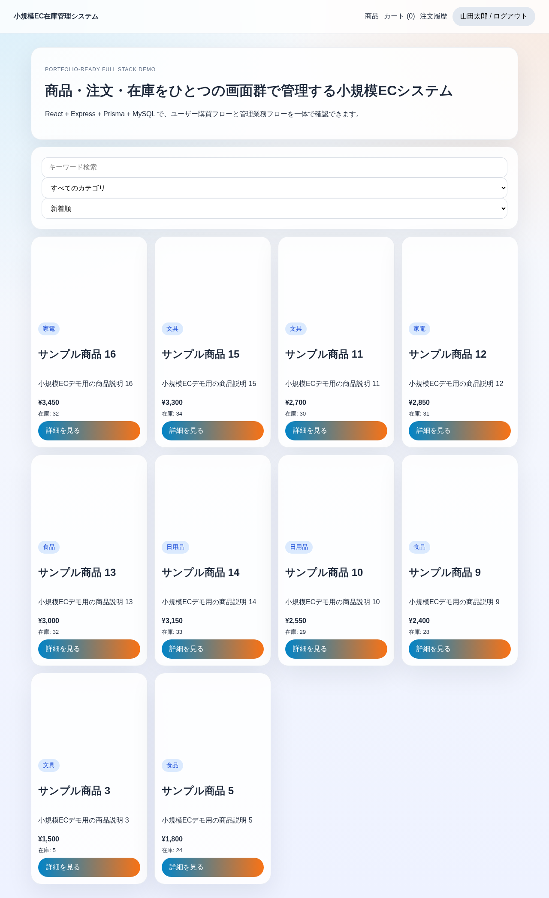
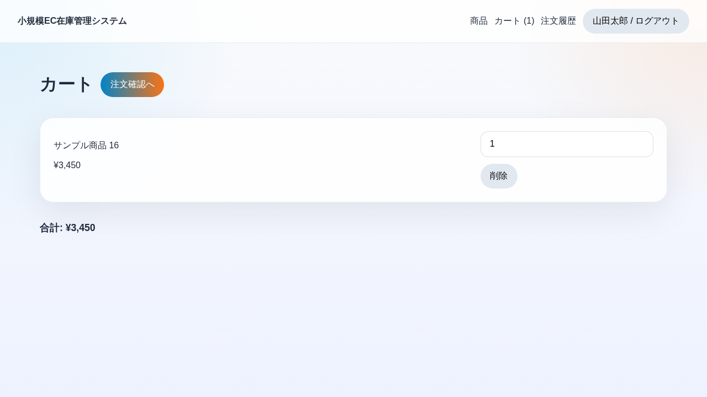
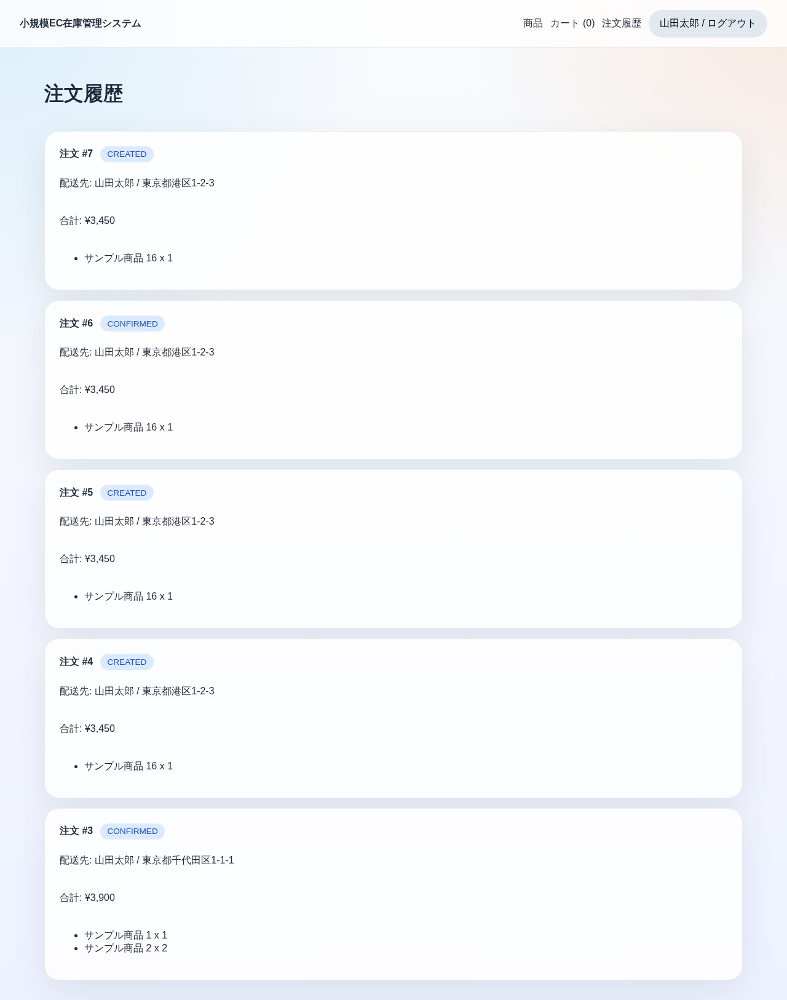
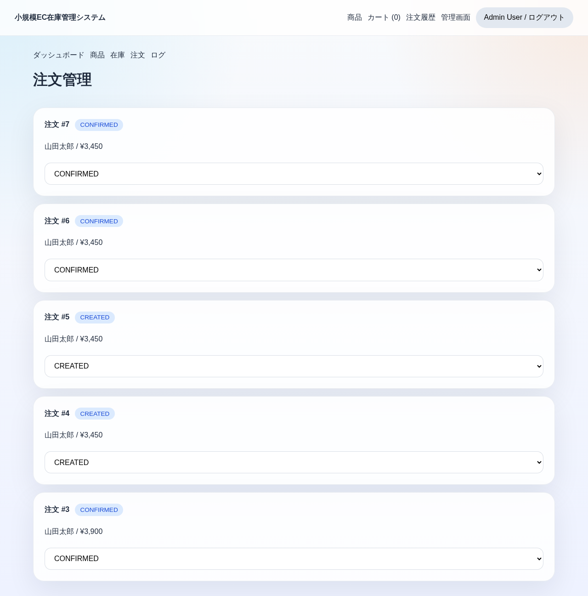

# Browser Smoke Report

## 検証範囲

Playwright を用いて、起動済みの `frontend` / `backend` / `mysql` コンテナに対して最小のブラウザ級 smoke test を実施しました。  
対象は「ユーザー購買フロー」と「管理者注文管理フロー」の最短導線です。

検証対象:

- ユーザーログイン
- 商品一覧表示
- 商品詳細からカート追加
- カートから注文作成
- 注文履歴表示
- 管理者ログイン
- 管理画面遷移
- 注文ステータス更新

対象テスト:

- [tests/smoke/ec-flow.spec.ts](../tests/smoke/ec-flow.spec.ts)

## 通過したフロー

### 1. ユーザー購買フロー

- `yamada@example.com / password123` でログイン成功
- 商品一覧が表示されることを確認
- 商品詳細画面から商品をカートへ追加
- カート画面で投入内容を確認
- 配送情報を入力して注文作成成功
- 注文履歴画面に遷移し、作成済み注文が表示されることを確認

### 2. 管理者注文管理フロー

- `admin@example.com / password123` でログイン成功
- 管理画面へ遷移できることを確認
- 注文管理画面で直前に作成した注文を特定
- ステータスを `CONFIRMED` に更新できることを確認

## 本輪の修復点

smoke test を安定実行するために、業務機能を増やさずに以下を調整しました。

- `docker-compose.yml` のトップレベル `version` を削除し、compose 警告を解消
- Playwright の最小設定を追加し、失敗時自動スクリーンショットと trace を有効化
- Vite dev server に `host.docker.internal` を許可
- frontend の API base URL を「環境変数優先、未指定時は現在の host から自動推定」に変更
- backend CORS を `localhost:5173` と `host.docker.internal:5173` の両方に対応
- smoke test の管理画面遷移とセレクタを安定化

## スクリーンショット

### 商品一覧

### カート

### 注文履歴

### 管理ダッシュボード

### 管理注文画面

## 備考

- smoke test は最小の主要導線確認を目的としており、全画面・全条件の網羅テストではありません
- 失敗時の Playwright 生成物は `test-results/` に出力されますが、公開リポジトリには含めない想定です
