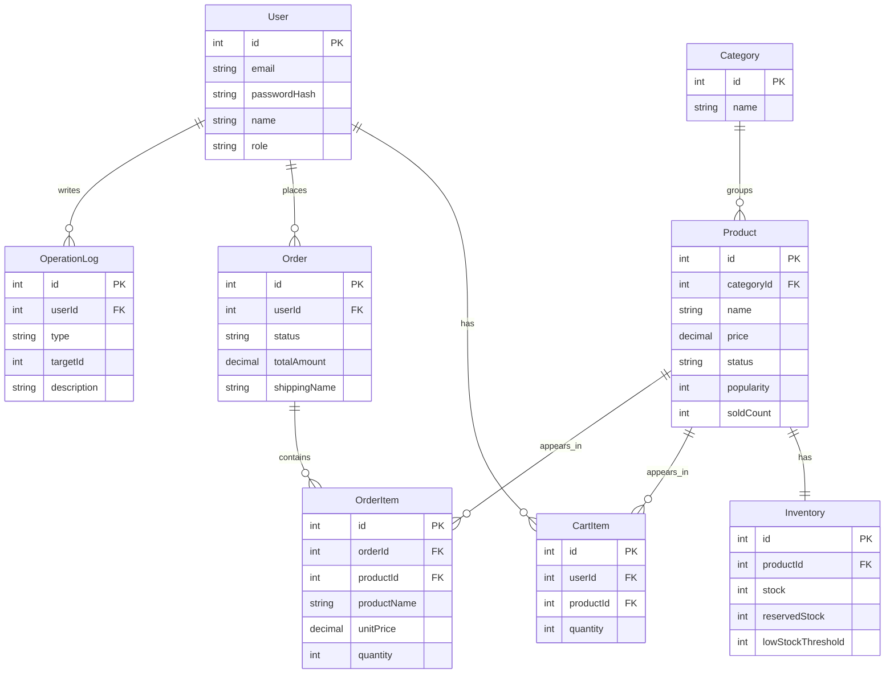

# ER 図

```mermaid
erDiagram
  User ||--o{ CartItem : has
  User ||--o{ Order : places
  User ||--o{ OperationLog : writes
  Category ||--o{ Product : groups
  Product ||--|| Inventory : has
  Product ||--o{ CartItem : appears_in
  Product ||--o{ OrderItem : appears_in
  Order ||--o{ OrderItem : contains

  User {
    int id PK
    string email
    string passwordHash
    string name
    string role
  }

  Category {
    int id PK
    string name
  }

  Product {
    int id PK
    int categoryId FK
    string name
    decimal price
    string status
    int popularity
    int soldCount
  }

  Inventory {
    int id PK
    int productId FK
    int stock
    int reservedStock
    int lowStockThreshold
  }

  CartItem {
    int id PK
    int userId FK
    int productId FK
    int quantity
  }

  Order {
    int id PK
    int userId FK
    string status
    decimal totalAmount
    string shippingName
  }

  OrderItem {
    int id PK
    int orderId FK
    int productId FK
    string productName
    decimal unitPrice
    int quantity
  }

  OperationLog {
    int id PK
    int userId FK
    string type
    int targetId
    string description
  }
```
